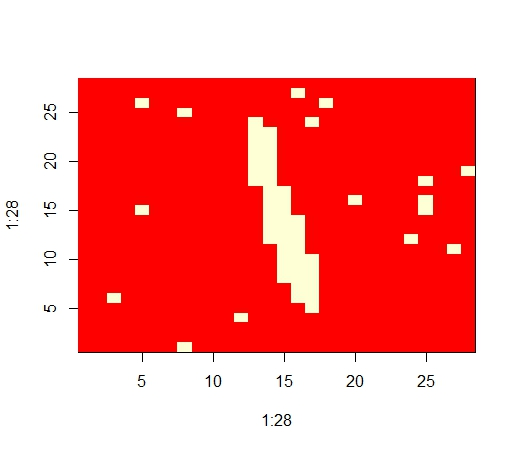

##Mean field inference for binary images 

The MNIST dataset consists of 60, 000 images of handwritten digits, curated by Yann LeCun, Corinna Cortes, and Chris Burges. You can find it here , together with a collection of statistics on recognition, etc. We will use the first 500 of the training set images.

Obtain the MNIST training set, and binarize the first 500 images by mapping any value below .5 to -1 and any value above to 1. For each image, create a noisy version by randomly flipping 2% of the bits.

Now denoise each image using a Boltzmann machine model and mean field inference. Use $theta_{ij}=0.2$ for the $H_i$, $H_j$ terms and $theta_{ij}=2$ for the $H_i$, $X_j$ terms. To hand in: Report the fraction of all pixels that are correct in the 500 images.

To hand in: Prepare a figure showing the original image, the noisy image, and the reconstruction for

a. your most accurate reconstruction

b. your least accurate reconstruction

Assume that $theta_{ij}$ for the $H_i$, $H_j$ terms takes a constant value c. We will investigate the effect of different values of c on the performance of the denoising algorithm. Think of your algorithm as a device that accepts an image, and for each pixel, predicts 1 or -1. You can evaluate this in the same way we evaluate a binary classifier, because you know the right value of each pixel. A receiver operating curve is a curve plotting the true positive rate against the false positive rate for a predictor, for different values of some useful parameter. We will use c as our parameter. To hand in: Using at least five values of c in the range -1 to 1, plot a receiver operating curve for your denoising algorithm.

##Answer:

```{r}
setwd("C:/Users/98302/Desktop/CS498HW7")
load_image <- function(path){
  val = list()
  fd = file(path,'rb')
  readBin(fd,'integer',n=1,size=4,endian='big')
  val$n = readBin(fd,'integer',n=1,size=4,endian='big')
  nrow = readBin(fd,'integer',n=1,size=4,endian='big')
  ncol = readBin(fd,'integer',n=1,size=4,endian='big')
  x = readBin(fd,'integer',n=val$n*nrow*ncol,size=1,signed=F)
  val$x = matrix(x, ncol=nrow*ncol, byrow=T)
  close(fd)
  val$x <- (val$x)[1:500, ]/255
  val$x[val$x < 0.5] <- -1.0
  val$x[val$x >= 0.5] <- 1.0
  return(val$x)
}

load_label <- function(path){
  fd = file(path,'rb')
  readBin(fd,'integer',n=1,size=4,endian='big')
  n = readBin(fd,'integer',n=1,size=4,endian='big')
  y = readBin(fd,'integer',n=n,size=1,signed=F)
  close(fd)
  return(y[1:500])
}

plot_img <- function(current){
  if(class(current) == "matrix"){
    mtx <- apply(current, 2, rev)
    image(1:28, 1:28, t(mtx))
  }else{
    mtx <- matrix(unlist(current), ncol = 28, byrow = T)
    mtx <- apply(mtx, 2, rev)
    image(1:28, 1:28, t(mtx))   
  }
}

roc_helper <- function(real, output){
  tn <- sum(real[output == -1] == -1)
  fp <- sum(real[output == 1] == -1)
  fn <- sum(real[output == -1] == 1)
  tp <- sum(real[output == 1] == 1)
  return(c(tp, tn, fp, fn))
}

mean_field <- function(img_data,hh,method){
    hx <- 2       #theta_{ij}=2 for the H_i, X_j terms
    tp <- 0
    tn <- 0
    fp <- 0
    fn <- 0
    
    stop_val <- 0.0000001
    best_acc <- 0
    worst_acc <- 1000
    correct_pixel <- 0
    best_real <- NULL
    best_noise <- NULL
    best_recon <- NULL
    worst_real <- NULL
    worst_noise <- NULL
    worst_recon <- NULL
    acc <- NULL
    for(i in seq(dim(img_data)[1])){
      real_img <- matrix(unlist(img_data[i, ]), ncol = 28, byrow = T)
      sample_pixel <- sample(1:length(real_img), 16, replace = F)#random sample 2%
      noise_img <- real_img
      noise_img[sample_pixel] <- -noise_img[sample_pixel]#flip the bits
      if(method == 0){
        old_pi <- matrix(0.5, 28, 28)
        new_pi <- matrix(0.5, 28, 28)
      }else if(method == 1){
        pi = noise_img
        pi[pi == -1] = 0
        old_pi <- pi
        new_pi <- pi
      }else if(method == 2){
        image = noise_img
        pi = matrix(0, 28, 28)
        count =  matrix(0, 28, 28)
        for(row in seq(28)){
           for(col in seq(28)){
              if(col != 1){#left one
                 pi[row,col] = pi[row,col] + (image[row, col-1] == 1)
                 count[row,col] = count[row,col] + 1
              }
              if(col != 28){#right one
                 pi[row,col] = pi[row,col] + (image[row, col+1] == 1)
                 count[row,col] = count[row,col] + 1
              }
              if(row != 1){#upper one
                 pi[row,col] = pi[row,col] + (image[row-1, col] == 1)
                 count[row,col] = count[row,col] + 1
              }
              if(row != 28){#lower one
                 pi[row,col] = pi[row,col] + (image[row+1, col] == 1)
                 count[row,col] = count[row,col] + 1
              }
           }
        }
        old_pi <- pi/count
        new_pi <- pi/count
      }else if(method == 3){
        old_pi = matrix(sample(0:1000,28*28)/1000, ncol = 28, byrow = T)
        new_pi = old_pi
      }
      
      #plot_img(noise_img)
      stop = 0
      while(stop < 1000){
        for(row in seq(28)){
           for(col in seq(28)){
              total <- 0
              if(col != 1)#left one
                 total <- total + hh*(2*old_pi[row, col-1]-1) + hx*(noise_img[row, col-1]) 
              if(col != 28)#right one
                 total <- total + hh*(2*old_pi[row, col+1]-1) + hx*(noise_img[row, col+1])
              if(row != 1)#upper one
                 total <- total + hh*(2*old_pi[row-1, col]-1) + hx*(noise_img[row-1, col])
              if(row != 28)#lower one
                 total <- total + hh*(2*old_pi[row+1, col]-1) + hx*(noise_img[row+1, col])
              new_pi[row, col] <- exp(total)/(exp(-total) + exp(total))
           }
        }
        stop = stop + 1
        if(norm(new_pi - old_pi, type = "F") < stop_val){
          break
        }
        old_pi <- new_pi
      }
      output_img <- new_pi
      output_img[output_img < 0.5] <- -1
      output_img[output_img >= 0.5] <- 1
      
      roc_result <- roc_helper(real_img, output_img)   # return(c(tp, tn, fp, fn))
      tp = tp + roc_result[1]
      tn = tn + roc_result[2]
      fp = fp + roc_result[3]
      fn = fn + roc_result[4]
            
      correct <- sum(output_img == real_img)
      acc = c(acc,correct/(28*28))
      correct_pixel = correct_pixel + correct
      if(correct < worst_acc){
        worst_acc = correct
        worst_real = real_img
        worst_noise = noise_img
        worst_recon = output_img
      }
      if(correct > best_acc){
        best_acc = correct
        best_real = real_img
        best_noise = noise_img
        best_recon = output_img
      }
    }# end of for loop
    TPR <- tp/(tp +fn)
    TNR <- tn/(tn + fp)
    overall_acc <- correct_pixel/(dim(img_data)[1]*28*28)
    return(list(c(TPR, TNR),best_real,best_noise,best_recon,worst_real,
                worst_noise,worst_recon,overall_acc,acc))
}
```
###Question 1  Reconstruction
```{r}
# reconstruction
img_data <- load_image("train-images.idx3-ubyte")
img_label <- load_label("train-labels.idx1-ubyte")
set.seed(0)
result = mean_field(img_data,0.2,method = 0)

TPR = result[[1]][1]
TNR = result[[1]][2]
c(TPR,TNR)
overall_acc <- result[[8]]
overall_acc
acc <- result[[9]]
sum(result[[2]] == result[[4]])/(28*28)
sum(result[[5]] == result[[7]])/(28*28)
summary(acc)
```
```{r eval=F}
plot_img(result[[2]])
plot_img(result[[3]])
plot_img(result[[4]])
plot_img(result[[5]])
plot_img(result[[6]])
plot_img(result[[7]])
```





The true positive rate over the 500 image is `r TPR` and the true negative rate is `r TNR`. The accuracy over the 500 images is `r overall_acc`. The best accuracy is `r sum(result[[2]] == result[[4]])/(28*28)`. The worst accuracy is `r sum(result[[5]] == result[[7]])/(28*28)`. The following is the plot of the accuracy of each image.

```{r}
id = 1:500
plot(id,acc,main="The accuracy of each image",xlab = "Image ID",
     ylab="Accuracy",pch=19)
```

###Question 2 Roc curve
```{r eval=F}
c <- seq(-1,1,0.1)
TPR_list <- NULL
TNR_list<- NULL
acc <- NULL
for(i in seq(length(c))){
  data <- mean_field(img_data,c[i],method = 0)
  TPR_list <- c(TPR_list, data[[1]][1])
  TNR_list <- c(TNR_list, data[[1]][2])
  acc <- c(acc,data[[8]])
}
```
```{r echo=F}
load("ROC.Rdata")
c <- seq(-1,1,0.1)
```

The following is the TPR,TNR,FPR and accuracy over 500 images of different c values. A negative c value is forcing neighboring pixels to be different, which the background pixels won't like. So the performance of negative c values is worse than positive c values.

```{r}
1 - TNR_list -> FPR_list
cbind(c,TPR_list,TNR_list,FPR_list,acc)
```

Here we just plot a receiver operating curve for your denoising algorithm using the eleven non-negative values of c.
```{r}
cbind(FPR_list,TPR_list)->roc
roc[11:21,]->roc
roc[order(roc[,1]),]->roc
roc = rbind(c(0,0),roc,c(1,1))
plot(roc[,1],roc[,2],"l",xlim=c(0,1),ylim=c(0,1), xlab = 
       "False positive rate (FPR)", ylab = "True positive rate (TPR)")
```

##More experiment

### 1.Different initialization of pi values

In the previous experiment, we initialized pi to be 0.5, a fixed value. Here we do more experiment with different initialization of pi values. 

When the parameter of `mean_field` funcition `method = 0`, the initialization of pi values are 0.5 for all.

When the parameter of `mean_field` funcition `method = 1`, the initialization of pi values are depending on $X_{ij}$ If $X_{ij} = -1$, $pi = 0$ and if $X_{ij} = 1$, $pi = 1$.

When the parameter of `mean_field` funcition `method = 2`, the initialization of pi values are fraction of neighbors that equals 1.

When the parameter of `mean_field` funcition `method = 3`, the initialization of pi values are random number between 0 and 1.
```{r eval=F}
method = c(0,1,2,3)
pi_TPR = NULL
pi_TNR = NULL
pi_acc = NULL
set.seed(0)
for(i in seq(length(method))){
  data <- mean_field(img_data,0.2,method = method[i])
  pi_TPR <- c(pi_TPR, data[[1]][1])
  pi_TNR <- c(pi_TNR, data[[1]][2])
  pi_acc <- c(pi_acc,data[[8]])
}
```{r echo=F}
load("pi.Rdata")
method = c(0,1,2,3)
```
```{r}
1 - pi_TNR -> pi_FPR
cbind(method,pi_TPR,pi_TNR,pi_FPR,pi_acc)
```

Conclusion:

From our experiment, we observed that different initialization methods have tiny impact on the overall accuracy, TPR, and FPR of the reconstruction result. Since we run the mean field inference until the pi matrix converges, different initialization values might affect the time and difficulty of convergence, but not the overall accuracy.

### 2. Exploration of the graphical model

Fo a pixel $H_i$, we assume that each unknown value depends on its four neighbors (up down left right) and on
observed value. Here we use a exploration of the graphical model that we assume each unknown value depends on its eight neighbors including the diagonals and on observed value.
```{r}
mean_field_diagonal <- function(img_data,hh,method){
    hx <- 2       #theta_{ij}=2 for the H_i, X_j terms
    tp <- 0
    tn <- 0
    fp <- 0
    fn <- 0
    best_real <- NULL
    best_noise <- NULL
    best_recon <- NULL
    worst_real <- NULL
    worst_noise <- NULL
    worst_recon <- NULL
    best_acc <- 0
    worst_acc <- 1000
    stop_val <- 0.0000001
    correct_pixel <- 0
    for(i in seq(dim(img_data)[1])){
      real_img <- matrix(unlist(img_data[i, ]), ncol = 28, byrow = T)
      sample_pixel <- sample(1:length(real_img), 16, replace = F)#random sample 2%
      noise_img <- real_img
      noise_img[sample_pixel] <- -noise_img[sample_pixel]#flip the bits
      if(method == 0){
        old_pi <- matrix(0.5, 28, 28)
        new_pi <- matrix(0.5, 28, 28)
      }else if(method == 1){
        pi = noise_img
        pi[pi == -1] = 0
        old_pi <- pi
        new_pi <- pi
      }else if(method == 2){
        image = noise_img
        pi = matrix(0, 28, 28)
        count =  matrix(0, 28, 28)
        for(row in seq(28)){
           for(col in seq(28)){
              if(col != 1){#left one
                 pi[row,col] = pi[row,col] + (image[row, col-1] == 1)
                 count[row,col] = count[row,col] + 1
              }
              if(col != 28){#right one
                 pi[row,col] = pi[row,col] + (image[row, col+1] == 1)
                 count[row,col] = count[row,col] + 1
              }
              if(row != 1){#upper one
                 pi[row,col] = pi[row,col] + (image[row-1, col] == 1)
                 count[row,col] = count[row,col] + 1
              }
              if(row != 28){#lower one
                 pi[row,col] = pi[row,col] + (image[row+1, col] == 1)
                 count[row,col] = count[row,col] + 1
              }
           }
        }
        old_pi <- pi/count
        new_pi <- pi/count
      }else if(method == 3){
        old_pi = matrix(sample(0:1000,28*28)/1000, ncol = 28, byrow = T)
        new_pi = old_pi
      }
      
      stop = 0
      while(stop < 1000){
        for(row in seq(28)){
           for(col in seq(28)){
              total <- 0
              if(col != 1)#left one
                 total <- total + hh*(2*old_pi[row, col-1]-1) + hx*(noise_img[row, col-1]) 
              if(col != 28)#right one
                 total <- total + hh*(2*old_pi[row, col+1]-1) + hx*(noise_img[row, col+1])
              if(row != 1)#upper one
                 total <- total + hh*(2*old_pi[row-1, col]-1) + hx*(noise_img[row-1, col])
              if(row != 28)#lower one
                 total <- total + hh*(2*old_pi[row+1, col]-1) + hx*(noise_img[row+1, col])
              if(col != 1 && row != 1)
                 total <- total + hh*(2*old_pi[row-1, col-1]-1) + hx*(noise_img[row-1, col-1]) 
              if(col != 28 && row != 1)
                 total <- total + hh*(2*old_pi[row-1, col+1]-1) + hx*(noise_img[row-1, col+1])
              if(col != 1 && row != 28)
                 total <- total + hh*(2*old_pi[row+1, col-1]-1) + hx*(noise_img[row+1, col-1])
              if(col != 28 && row != 28)
                 total <- total + hh*(2*old_pi[row+1, col+1]-1) + hx*(noise_img[row+1, col+1])
              new_pi[row, col] <- exp(total)/(exp(-total) + exp(total))
           }
        }
        stop = stop + 1
        if(norm(new_pi - old_pi, type = "F") < stop_val){
          break
        }
        old_pi <- new_pi
      }
      output_img <- new_pi
      output_img[output_img < 0.5] <- -1
      output_img[output_img >= 0.5] <- 1
      
      roc_result <- roc_helper(real_img, output_img)   # return(c(tp, tn, fp, fn))
      tp = tp + roc_result[1]
      tn = tn + roc_result[2]
      fp = fp + roc_result[3]
      fn = fn + roc_result[4]
            
      correct <- sum(output_img == real_img)
      correct_pixel = correct_pixel + correct
      if(correct < worst_acc){
        worst_acc = correct
        worst_real = real_img
        worst_noise = noise_img
        worst_recon = output_img
      }
      if(correct > best_acc){
        best_acc = correct
        best_real = real_img
        best_noise = noise_img
        best_recon = output_img
      }
    }# end of for loop
    TPR <- tp/(tp +fn)
    TNR <- tn/(tn + fp)
    acc = correct_pixel / (dim(img_data)[1]*28*28)
    return(list(c(TPR, TNR),acc,best_real,best_noise,best_recon,worst_real,
                worst_noise,worst_recon))
}
```
```{r}
set.seed(0)
diagonal = mean_field_diagonal(img_data,0.2,method = 0)
diagonal[[1]]#TPR,TNR
diagonal[[2]]#overall accuracy
```
Thus we can find that when each unknown value depends on its eight neighbors including the diagonals, its performance will be worse than considering four neighbors. Herw we choose one image to see what the difference is between eight-neighbor stratgy and four-neighbor stratgy.
```{r}
set.seed(0)
four = mean_field(img_data[1:2,],0.2,method = 0)
four[[8]]#accuracy
set.seed(0)
eight = mean_field_diagonal(img_data[1:2,],0.2,method = 0)
eight[[2]]#accuracy
```
```{r eval=F}
plot_img(four[[2]])
plot_img(four[[4]])
plot_img(eight[[8]])
```

Conclusion:

From our experiment, we observed the new graphical model with 8 adjacent achieves slightly less accuracy than the four neighbors model, but its overall result is still reasonable. The difference comes from the pixels that lay on the boundary between the stroke and non-stroke (background, red color) of the image. The 8 adjacent model enforces stronger field inference on a wider area, and some pixels on the boundary of the stroke are more easily be inferred as background color rather than pixel color since more of its neighbors are background. A reasonable change in graphical model has impact on the overall result, but insignificant. 


