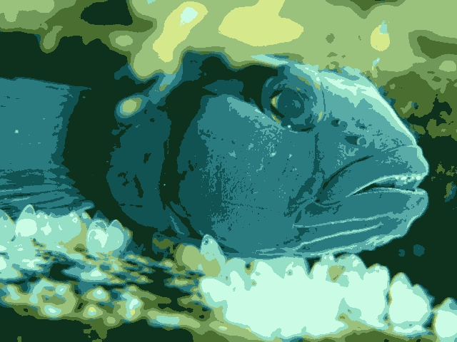

#Problem 1 EM Topic models
The UCI Machine Learning dataset repository hosts several datasets recording word counts for documents here. You will use the NIPS dataset. You will find (a) a table of word counts per document and (b) a vocabulary list for this dataset at the link. You must implement the multinomial mixture of topics model, lectured in class. For this problem, you should write the clustering code yourself (i.e. not use a package for clustering).

Cluster this to 30 topics, using a simple mixture of multinomial topic model, as lectured in class.

###Answer:
```{r}
#install.packages("matrixStats")
library(matrixStats)
setwd("C:/Users/98302/Desktop/CS498AML/homework6")
#=================read in files========================
set.seed(0)
vocabulary <- read.csv("vocab.nips.txt",header = F)
documents <- read.csv("docword.nips.txt", sep = " ", skip = 3, header = FALSE)

#=================Constants============================
document_num <- 1500 
vocab_num <- length(vocabulary[,1])
word_num <- dim(documents)[1]
smooth <- .0003
stop_val <- .0005
topic_num <- 30
Q_value <- NULL

#=================initilization========================
topic_weight<- matrix(1/30,1,topic_num)
topic_vocab <- matrix(0,topic_num,vocab_num)
set.seed(0)
for(x in 1:topic_num){
  uniform_dist <- runif(vocab_num)
  topic_vocab[x,] <- uniform_dist/sum(uniform_dist)
}

document_vocab <- matrix(0,document_num,vocab_num)
for(i in 1:word_num){
  document_vocab[documents[i,1], documents[i,2]] = documents[i,3]
}
#======================EM============================
while(TRUE){
  #==================E Step==========================
  core <- document_vocab %*% t(log(topic_vocab)) 
  w_ij <- matrix(0,document_num,topic_num) 
  for(i in 1:topic_num){
    core[,i] <- core[,i] + log(topic_weight[i])
  }
  for(i in 1:document_num){
    w_ij[i,] = exp(core[i,]-logSumExp(core[i,]))
  }
  Q_value <- c(Q_value, sum(core * w_ij))
  
  #=================check for stop====================
  if(length(Q_value) > 1){
    if(abs(Q_value[length(Q_value)] - Q_value[length(Q_value)-1]) < stop_val){
      break
    }
  }
  #==================M step===========================
  for(j in 1:topic_num){
    dem <- 0
    for(z in 1:document_num){
        dem = dem + sum(document_vocab[z, ]) * w_ij[z, j]
    }
    topic_vocab[j, ] <- (colSums(document_vocab * w_ij[, j])+ 
                           smooth)/(dem + smooth)
    topic_weight[j] <- sum(w_ij[,j]) / document_num
  }
}
```

Produce a graph showing, for each topic, the probability with which the topic is selected.

###Answer:
```{r}
plot(as.vector(topic_weight), type='l', ylab = "probability", 
     xlab="topic", main = "Topic Probability")
```

Produce a table showing, for each topic, the 10 words with the highest probability for that topic.

###Answer:
```{r}
colnames(topic_vocab) <- as.character(vocabulary[,1])
table = NULL
topic = NULL
for(i in 1:topic_num){
  word <- rownames(as.data.frame(sort(topic_vocab[i,], decreasing = TRUE)[1:10]))
  table = rbind(table,word)
  topic = c(topic,paste("Topic", i , ":",seq=""))
}
rownames(table) <- topic
table
```

#Problem 2 Image segmentation using EM 
You can segment an image using a clustering method - each segment is the cluster center to which a pixel belongs. In this exercise, you will represent an image pixel by its r, g, and b values (so use color images!). Use the EM algorithm applied to the mixture of normal distribution model lectured in class to cluster image pixels, then segment the image by mapping each pixel to the cluster center with the highest value of the posterior probability for that pixel. You must implement the EM algorithm yourself (rather than using a package). We will release a set of test images shortly; till then, use any color image you care to.

Segment each of the test images to 10, 20, and 50 segments. You should display these segmented images as images, where each pixel's color is replaced with the mean color of the closest segment

###Answer:
```{r}
library(jpeg)
library(matrixStats)
options(digits=10)
fish <- readJPEG("fish.jpg")
flower <- readJPEG("flower.jpg")
sky <- readJPEG("sky.jpg")

pic_cluster <- function(picture, clusters, seed){
  img_row <- dim(picture)[1]
  img_col <- dim(picture)[2]
  vector_length <- img_row * img_col
  pic <- matrix(0, 3, vector_length)   # xi   3 * (307200) #pixels
  w_ij <- matrix(0, vector_length, clusters)
  # segment mean matrix 3 * number of segments
  segment_mean <- matrix(0, 3, clusters)
  # weight of each segment 1 * number of segments 
  segment_weight <- matrix(0, 1, clusters)  
  stop_val <- 0.1
  smooth_val <- 0.00001
  Q_value <- NULL
  
  for(i in 1:img_row){
    for(j in 1:img_col){
        pic[,((i-1)*img_col)+j] <- picture[i, j, ]
    }
  }
  mtx <- t(scale(t(pic)))
  
  #================kmean, setting init==================
  image_dim <- dim(picture)
  imgRGB <- data.frame(
    x = rep(1:image_dim[2], each = image_dim[1]),
    y = rep(image_dim[1]:1, image_dim[2]),
    R = as.vector(picture[,,1]),
    G = as.vector(picture[,,2]),
    B = as.vector(picture[,,3])
  )
  set.seed(seed)
  kmean <- kmeans(imgRGB[, c("R", "G", "B")], centers = clusters, iter.max = 500)
  for(j in 1:clusters){
    segment_mean[, j] <- kmean$centers[j, ]
    segment_weight[j] <- kmean$size[j]/vector_length   # initial probability of each segment
  }
  
  #================EM==================
  while(TRUE){
    #================E Step==================
    current_q <- 0
    inner <- matrix(0, vector_length, clusters)
    #inner + probablity of each cluster 
    w_ij <- matrix(0,vector_length,clusters) 
    for(j in 1:clusters){
      very_inner <- t(mtx - t(segment_mean)[j, ])
      inner[,j] <- 100 * -(1/2) * rowSums(very_inner ^ 2) + log(segment_weight[j])
    }
    
    #calculate w_ij s
   	top <- exp(inner)
    bottom <- rowSums(top)
    w_ij <- top/bottom     # vector_length * clusters
	  if(sum(is.nan(w_ij)) > 0){
	    w_ij <- matrix(0,vector_length,clusters) 
	    for(i in 1:vector_length){
	      w_ij[i,] = exp(inner[i,]-logSumExp(inner[i,]))
	    }
	  } 
    
    current_q <- sum(inner * w_ij)  # inner product ----> Q value
    Q_value <- c(Q_value, current_q)
    #print(current_q)
    #================M Step==================
    for(j in 1:clusters){
      top <- colSums(t(mtx) * w_ij[,j]) + smooth_val
      segment_mean[, j] <- top/(sum(w_ij[, j]) + smooth_val)
      segment_weight[j] <- (sum(w_ij[, j]))/vector_length  
    }
    
    #==============stopping rule===========================================
    if(length(Q_value) > 1){
      if(abs(Q_value[length(Q_value)] - (Q_value[length(Q_value)-1])) < stop_val){
        break
      }
    }
  }

  final <- array(0, c(img_row, img_col, 3))
  for(i in 1:img_row){
    for(j in 1:img_col){
      index <- (i-1)*img_col + j
      points <- mtx[, index]
      meanseg <- which(w_ij[index,] == max(w_ij[index,]))
      final[i, j, ] <- segment_mean[, meanseg] * attr(mtx, 'scaled:scale') + 
                       attr(mtx, 'scaled:center')
    }
  }
  return(final)
}
```
```{r eval=F}
writeJPEG(pic_cluster(fish, 10, 0), "fish_segmented10.jpg",quality = 1)
writeJPEG(pic_cluster(fish, 20, 0), "fish_segmented20.jpg",quality = 1)
writeJPEG(pic_cluster(fish, 50, 0), "fish_segmented50.jpg",quality = 1)

writeJPEG(pic_cluster(flower, 10, 0), "flower_segmented10.jpg",quality = 1)
writeJPEG(pic_cluster(flower, 20, 0), "flower_segmented20.jpg",quality = 1)
writeJPEG(pic_cluster(flower, 50, 0), "flower_segmented50.jpg",quality = 1)

writeJPEG(pic_cluster(sky, 10, 0), "sky_segmented10.jpg",quality = 1)
writeJPEG(pic_cluster(sky, 20, 0), "sky_segmented20.jpg",quality = 1)
writeJPEG(pic_cluster(sky, 50, 0), "sky_segmented50.jpg",quality = 1)
```



We will identify one special test image. You should segment this to 20 segments using five different start points, and display the result for each case. Is there much variation in the result?

###Answer:

Observed from our result, there isn't much variation of the last 5 images using K-mean with slightly different clustering each runs. The sky picture has notable color layer contrast in each shades, and the only visible difference appears in the middle of the image where each shades of colors join and mingle together. Since we run EM algorithm until it converges, we expect that there shouldn't be much of variance in the area that has strong color contrast from its adjacent shades, and small distinction in the joint area, as shown in our result.

```{r eval=F}
writeJPEG(pic_cluster(sky, 20, 0), "sky_segmented20_1.jpg",quality = 1)
writeJPEG(pic_cluster(sky, 20, 1), "sky_segmented20_2.jpg",quality = 1)
writeJPEG(pic_cluster(sky, 20, 2), "sky_segmented20_3.jpg",quality = 1)
writeJPEG(pic_cluster(sky, 20, 3), "sky_segmented20_4.jpg",quality = 1)
writeJPEG(pic_cluster(sky, 20, 4), "sky_segmented20_5.jpg",quality = 1)
```


